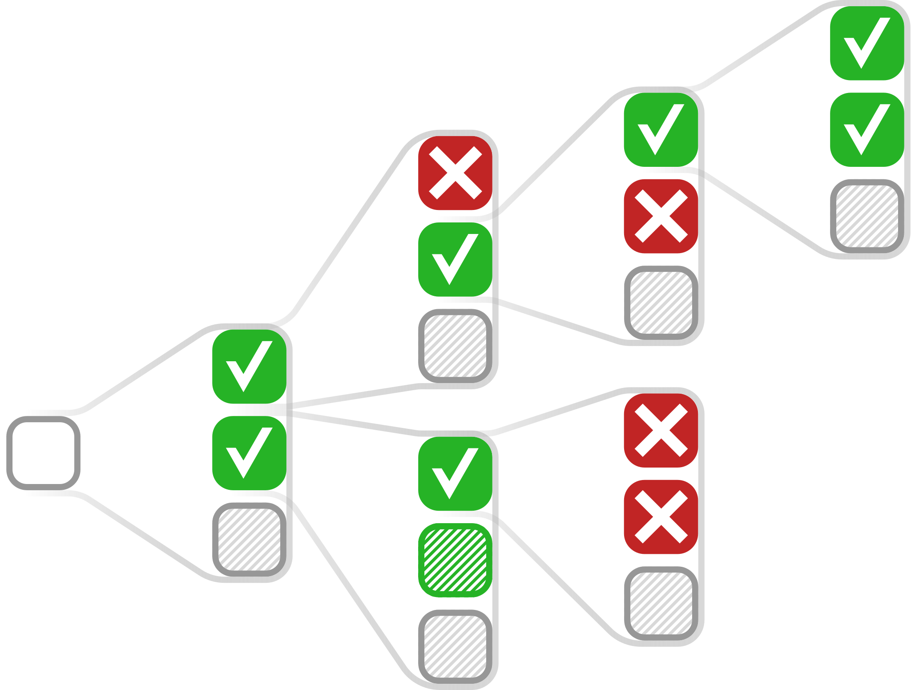

<p align="center">
    <br>
    
    <br>
<p>
<p align="center">
    <a href="https://github.com/ElementAI/picard/actions/workflows/build.yml">
        
    </a>
    <a href="https://github.com/ElementAI/picard/blob/main/LICENSE">
        
    </a>
    <a href="https://zenodo.org/badge/latestdoi/tbd"></a>
</p>

This is the official implementation of the following paper:

[Torsten Scholak](https://twitter.com/tscholak), Nathan Schucher, Dzmitry Bahdanau. [PICARD - Parsing Incrementally for Constrained Auto-Regressive Decoding from Language Models](). *Proceedings of the 2021 Conference on Empirical Methods in Natural Language Processing (EMNLP).*

## Overview

This code implements:

* The PICARD algorithm for constrained decoding from language models.
* A text-to-SQL semantic parser based on pre-trained sequence-to-sequence models and PICARD achieving state-of-the-art performance on both the [Spider](https://yale-lily.github.io/cosql) and the [CoSQL](https://yale-lily.github.io/cosql) datasets. 

## About PICARD

> **TL;DR:** We introduce PICARD -- a new method for simple and effective constrained decoding from large pre-trained language models.
> On the challenging Spider and CoSQL text-to-SQL datasets, PICARD significantly improves the performance of fine-tuned but otherwise unmodified T5 models.
> Using PICARD, our T5-3B models achieved state-of-the-art performance on both Spider and CoSQL.

In text-to-SQL translation, the goal is to translate a natural language question into a SQL query.
There are two main challenges to this task:

1. The generated SQL needs to be semantically correct, that is, correctly reflect the meaning of the question.
2. The SQL also needs to be valid, that is, it must not result in an execution error.

So far, there has been a trade-off between these two goals:
The second problem can be solved by using a special decoder architecture that -- by construction -- always produces valid SQL.
This is the approach taken by most prior work.
Those decoders are called "constrained decoders", and they need to be trained from scratch on the text-to-SQL dataset.
However, this limits the generality of the decoders, which is a problem for the first goal.

A better approach would be to use a pre-trained encoder-decoder model and to constrain its decoder to produce valid SQL after fine-tuning the model on the text-to-SQL task.
This is the approach taken by the PICARD algorithm.

### How is PICARD different from existing constrained decoders?

* It’s an incremental parsing algorithm that integrates with ordinary beam search.
* It doesn’t require any training.
* It doesn’t require modifying the model.
* It works with any model that generates a sequence of tokens (including language models).
* It doesn’t require a special vocabulary.
* It works with character-, sub-word-, and word-level language models.

### How does PICARD work?

The following picture shows how beam search is integrated with PICARD.

<p align="center">
    <br>
    
    <br>
<p>

Decoding starts from the left and proceeds to the right.
The algorithm begins with a single token (usually `<s>`),
and then keeps expanding the beam with hypotheses generated token-by-token by the decoder.
At each decoding step and for each hypothesis,
PICARD checks whether the next top-`k` tokens are valid.
In the image above, only 3 token predictions are shown, and `k` is set to 2.
Valid tokens (☑) are added to the beam. Invalid ones (☒) are discarded.
Like in normal beam search, the beam is pruned to contain only the top-`n` hypotheses.
`n` is the beam size, and in the image above it is set to at least 2.
Hypotheses that are terminated with the end-of-sentence token (usually `</s>`) are not expanded further.
The algorithm stops when the all hypotheses are terminated
or when the maximum number of tokens has been reached.

### How does PICARD know whether a token is valid?

tbd.

### How well does PICARD work?

Let's look at the numbers:

#### On Spider

<table>
  <tr>
    <th rowspan=2 valign=bottom>URL</th>
    <th colspan=2>Exact-set Match Accuracy</th>
    <th colspan=2>Execution Accuracy</th>
  </tr>
  <tr>
    <th>Dev</th>
    <th>Test</th>
    <th>Dev</th>
    <th>Test</th>
  </tr>
  <tr>
    <td><b><a href="https://huggingface.co/tscholak/cxmefzzi">tscholak/cxmefzzi</a> w PICARD</b></td>
    <td><b>75.5 %</b></td>
    <td><b>71.9 %</b></td>
    <td><b>79.3 %</b></td>
    <td><b>75.1 %</b></td>
  </tr>
  <tr>
    <td><a href="https://huggingface.co/tscholak/cxmefzzi">tscholak/cxmefzzi</a> w/o PICARD</td>
    <td>71.5 %</td>
    <td>68.0 %</td>
    <td>74.4 %</td>
    <td>70.1 %</td>
  </tr>
</table>

Click on the links to download the model.

#### On CoSQL Dialogue State Tracking

<table>
  <tr>
    <th rowspan=2 valign=bottom>URL</th>
    <th colspan=2>Question Match Accuracy</th>
    <th colspan=2>Interaction Match Accuracy</th>
  </tr>
  <tr>
    <th>Dev</th>
    <th>Test</th>
    <th>Dev</th>
    <th>Test</th>
  </tr>
  <tr>
    <td><b><a href="https://huggingface.co/tscholak/2e826ioa">tscholak/2e826ioa</a> w PICARD</b></td>
    <td><b>56.9 %</b></td>
    <td><b>54.6 %</b></td>
    <td><b>24.2 %</b></td>
    <td><b>23.7 %</b></td>
  </tr>
  <tr>
    <td><a href="https://huggingface.co/tscholak/2e826ioa">tscholak/2e826ioa</a> w/o PICARD</td>
    <td>53.8 %</td>
    <td>51.4 %</td>
    <td>21.8 %</td>
    <td>21.7 %</td>
  </tr>
</table>

Click on the links to download the model.

## Quick Start

### Prerequisites

This repository uses git submodules. Clone it like this:
```sh
$ git clone git@github.com:ElementAI/picard.git
$ cd picard
$ git submodule update --init --recursive
```

### Docker

There are three docker images that can be used to run the code:

* **[tscholak/text-to-sql-dev](https://hub.docker.com/repository/docker/tscholak/text-to-sql-dev):** Base image with development dependencies. Use this for development. Pull it with `make pull-dev-image` from the docker hub. Rebuild the image with `make build-dev-image`. 
* **[tsscholak/text-to-sql-train](https://hub.docker.com/repository/docker/tscholak/text-to-sql-train):** Training image with development dependencies but without Picard dependencies. Use this for fine-tuning a model. Pull it with `make pull-train-image` from the docker hub. Rebuild the image with `make build-train-image`.
* **[tscholak/text-to-sql-eval](https://hub.docker.com/repository/docker/tscholak/text-to-sql-eval):** Training/evaluation image with all dependencies. Use this for evaluating a fine-tuned model with Picard. This image can also be used for training if you want to run evaluation during training with Picard. Pull it with `make pull-eval-image` from the docker hub. Rebuild the image with `make build-eval-image`.

All images are tagged with the current commit hash. The images are built with the buildx tool which is available in the latest docker-ce. Use `make init-buildkit` to initialize the buildx tool on your machine. You can then use `make build-dev-image`, `make build-train-image`, etc. to rebuild the images. Local changes to the code will not be reflected in the docker images unless they are committed to git.

### Training

The training script is located in `seq2seq/run_seq2seq.py`.
You can run it with:
```
$ make train
```
The model will be trained on the Spider dataset by default.
You can also train on CoSQL by running `make train-cosql`.

The training script will create the directory `train` in the current directory.
Training artifacts like checkpoints will be stored in this directory.

The default configuration is stored in `configs/train.json`.
The settings are optimized for a GPU with 40GB of memory.

These training settings should result in a model
with at least 71% exact-set-match accuracy on the Spider development set.
With PICARD, the accuracy should go up to at least 75%.

We have uploaded a model trained on the Spider dataset to the huggingface model hub,
<a href="https://huggingface.co/tscholak/cxmefzzi">tscholak/cxmefzzi</a>.
A model trained on the CoSQL dialog state tracking dataset is available, too,
<a href="https://huggingface.co/tscholak/2e826ioa">tscholak/2e826ioa</a>.

### Evaluation

The evaluation script is located in `seq2seq/run_seq2seq.py`.
You can run it with:
```
$ make eval
```
By default, the evaluation will be run on the Spider evaluation set.
Evaluation on the CoSQL evaluation set can be run with `make eval-cosql`.

The evaluation script will create the directory `eval` in the current directory.
The evaluation results will be stored there.

The default configuration is stored in `configs/eval.json`.


## Citation

If you use this code, please cite the following paper:

```bibtex
@inproceedings{Scholak2021:PICARD,
  author = {Torsten Scholak and Nathan Schucher and Dzmitry Bahdanau},
  title = {PICARD - Parsing Incrementally for Constrained Auto-Regressive Decoding from Language Models},
  booktitle = {EMNLP 2021},
  year = {2021},
}
```
